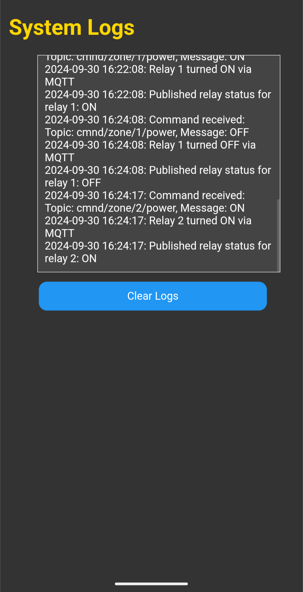
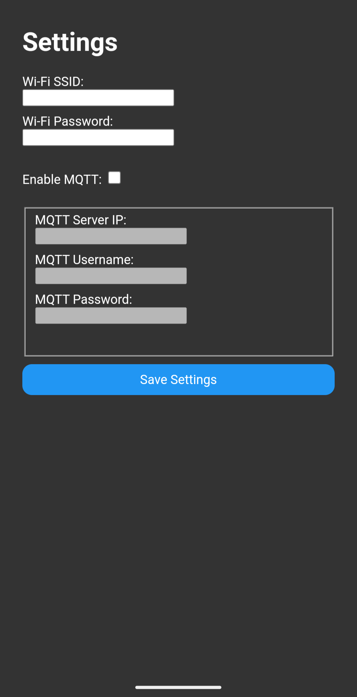
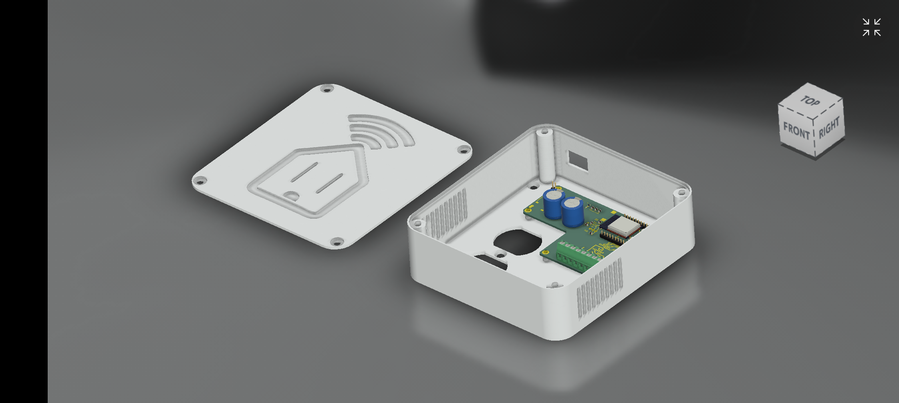
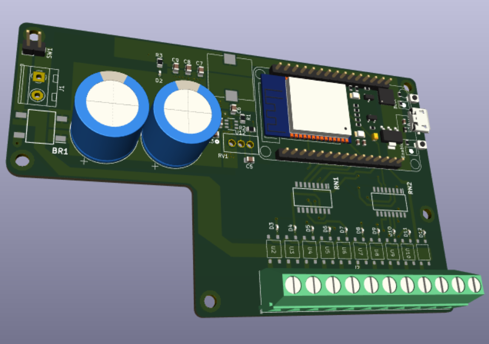
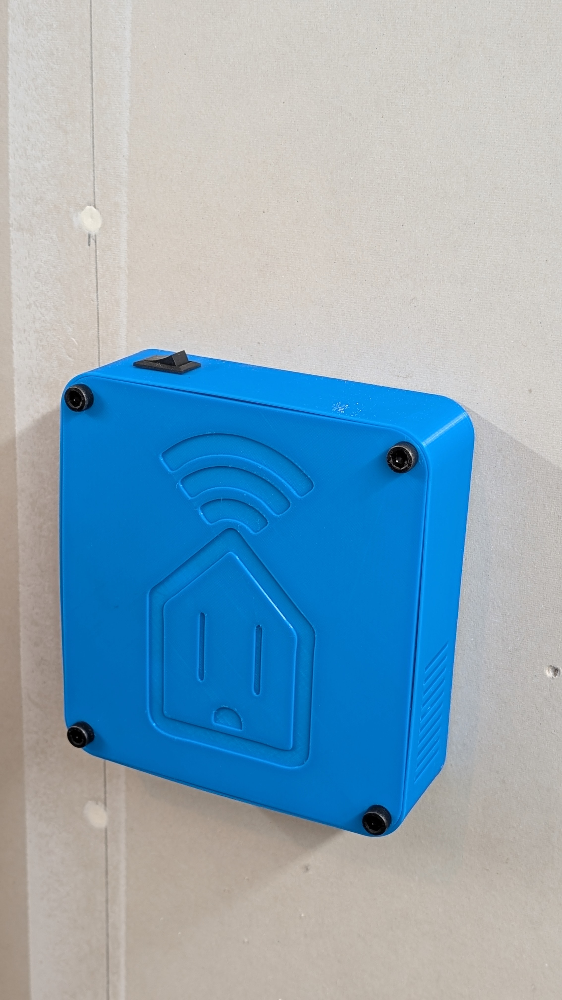

Introduction:
-
Smart irrigation controllers are overpriced and lack customizability so I set out to develop a simple and easy to use solution that is also robust and reliable. The intellidwell sprinkler controller uses custom micropython firmware developed for the ESP32. A localized server that runs right on the microcontroller allows for scheduling, smart phone control, and integration with smart home systems via MQTT. Solid state relays provide extrememely reliable switching of 24VAC solenoid sprinkler valves. A custom 24VAC to 5VDC (variable via a potentiometer) converter allows the logic to be powered from the same source as the sprinkler valve power.

Components used:
-
- ESP32 dev board - https://www.amazon.com/gp/product/B0C7C2HQ7P/ref=ppx_yo_dt_b_search_asin_title?ie=UTF8&psc=1
- Custom PCB - https://github.com/TannerNelson16/sprinkler_controller/blob/master/PCB_files/Sprinkler_Controller_V2/Sprinkler_Controller_V2/Sprinkler_Controller_V2.zip
- PCB parts - https://www.digikey.com/en/mylists/list/P86LUORYGY
- 3d printed container - https://github.com/TannerNelson16/sprinkler_controller/tree/master/V2_Enclosure
- 24v transformer - https://a.co/d/7ivDpOn
- Hardware:
  - https://a.co/d/18vTyet
  - https://a.co/d/1JvqW7l

Web UI:
-
<p float="left">
   
  
   
   

</p>


Installation:
-
FOR LINUX:
--
First install the micropython environment on your ESP32. Here's the official documentation: https://docs.micropython.org/en/latest/esp32/tutorial/intro.html 

For the condensed version:
- Download micropython here: https://micropython.org/resources/firmware/ESP32_GENERIC-20240222-v1.22.2.bin
- Run the following command in the ubuntu terminal:
```
pip install esptool
```
- From the folder where the micropython file is located, run the following commands:
```
esptool.py --chip esp32 --port /dev/ttyUSB0 erase_flash
esptool.py --chip esp32 --port /dev/ttyUSB0 --baud 460800 write_flash -z 0x1000 ESP32_GENERIC-20240222-v1.22.2.bin
```
Once micropython has been successfully installed on the board, download the files in the repository navigate to it's folder.

Once this is complete, save the file and run the following commands:
```
pip install adafruit-ampy
ampy --port /dev/ttyUSB0 put index.html
ampy --port /dev/ttyUSB0 put scheduler.html
ampy --port /dev/ttyUSB0 put logs.html
ampy --port /dev/ttyUSB0 put settings.html
ampy --port /dev/ttyUSB0  put microdot.py
ampy --port /dev/ttyUSB0  put microdot_asyncio.py
ampy --port /dev/ttyUSB0  put controller.py /main.py
```
Reboot and connect to the "intellidwellSC" SSID with password "Sprinkler12345" from any device. In a browser type in 192.168.4.1 to access the sprinkler controller UI.

To connect to a Wifi Network navigate to "Settings" on the main page and enter in your WiFi credentials. You can also input your MQTT credentials here if you wish. When the device is rebooted, you can access the UI from the hostname http://sprinklers.local on your network, the IP address of the device, or from your homeassitant instance via the MQTT integration.

NOTE: If the network is unavailable, the ESP32 will first try to connect without the MQTT integration. If the network is still causing errors, the ESP32 will resume AP mode to allow for control of the sprinkler system. 

Enclosure:
-
<p float="left">
   


Assembly:
-
PCB:
- The PCB has been tested and is fully functional.
- Download the zipped folder here: https://github.com/TannerNelson16/sprinkler_controller/blob/master/PCB_files/Sprinkler_Controller_V2/Sprinkler_Controller_V2/Sprinkler_Controller_V2.zip
- Upload the folder to jlcpcb.com or your chosen pcb manufacturer
- Purchase items from digikey to populate board: https://www.digikey.com/en/mylists/list/P86LUORYGY
- Rocker switches on amazon, if out of stock at digikey: https://a.co/d/f25Jjgr
<p float="left">
  
Final Product Images:
-
<p float="left">
   
<p float="left">
   


Support This Project
-

If you like this project, consider supporting it with a donation!

[](https://buy.stripe.com/6oEdU3dWS19C556dQQ)
