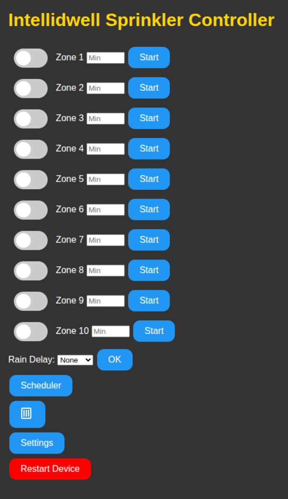

Smart irrigation controllers are overpriced and lack customizability so I set out to develop a simple and easy to use solution that is also robust and reliable.

Components used:
-
- ESP32 dev board - https://www.amazon.com/gp/product/B0C7C2HQ7P/ref=ppx_yo_dt_b_search_asin_title?ie=UTF8&psc=1
- 16 channel relay board - https://www.amazon.com/gp/product/B07Y2X4F77/ref=ppx_yo_dt_b_search_asin_title?ie=UTF8&psc=1
- Step Down Buck converter - https://www.amazon.com/gp/product/B08B3T9DX4/ref=ppx_yo_dt_b_search_asin_title?ie=UTF8&psc=1
- Amazon Fire HD 8" Tablet - https://www.amazon.com/gp/product/B07952VWF2/ref=ppx_yo_dt_b_search_asin_title?ie=UTF8&psc=1 
- 3d printed container

Web UI:
-



Installation:
-
FOR LINUX:
--
First install the micropython environment on your ESP32. Here's the official documentation: https://docs.micropython.org/en/latest/esp32/tutorial/intro.html 

For the condensed version:
- Download micropython here: https://micropython.org/resources/firmware/ESP32_GENERIC-20240222-v1.22.2.bin
- Run the following command in the ubuntu terminal:
```
pip install esptool
```
- From the folder where the micropython file is located, run the following commands:
```
esptool.py --chip esp32 --port /dev/ttyUSB0 erase_flash
esptool.py --chip ^Cp32 --port /dev/ttyUSB0 --baud 460800 write_flash -z 0x1000 ESP32_GENERIC-20240222-v1.22.2.bin
```
Once micropython has been successfully installed on the board, download the files in the repository navigate to it's folder.

Open the controller.py file using vi, nano, or another editor of your choice and change the ssid, wifi password, mqtt broker ip address, mqtt username, and mqtt password. (If you don't want the MQTT Integration, let me know and I can modify the code to accomodate that)

Once this is complete, save the file and run the following commands:
```
pip install adafruit-ampy
ampy --port /dev/ttyUSB0 put index.html
ampy --port /dev/ttyUSB0 put scheduler.html
ampy --port /dev/ttyUSB0  put microdot.py
ampy --port /dev/ttyUSB0  put microdot_asyncio.py
ampy --port /dev/ttyUSB0  put controller.py /main.py
```
Reboot and navigate to the board's IP address from a web browser. You should also see the Zones auto populate in your home assistant instance if applicable.
